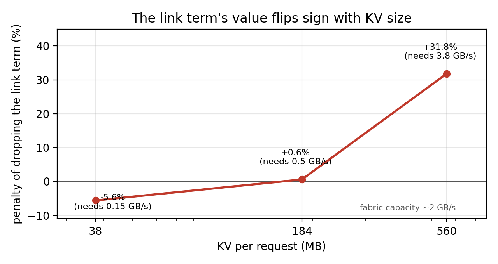
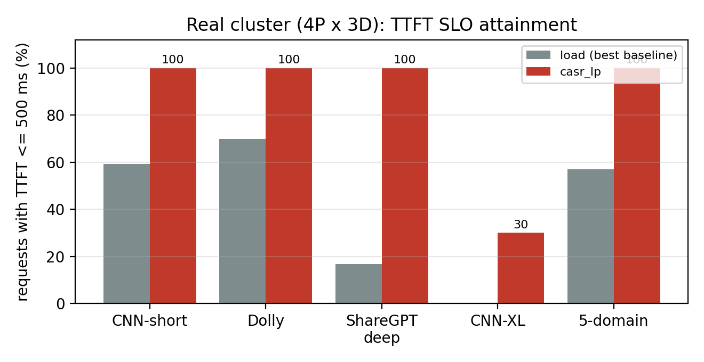
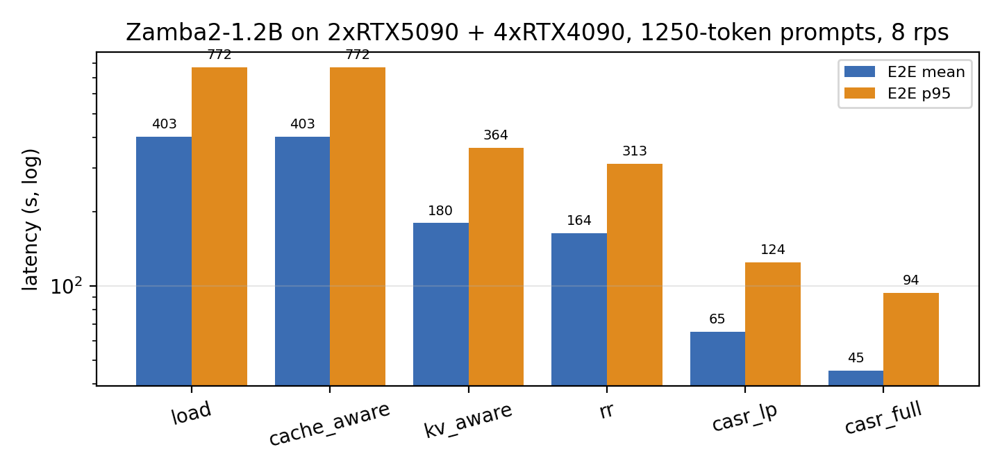
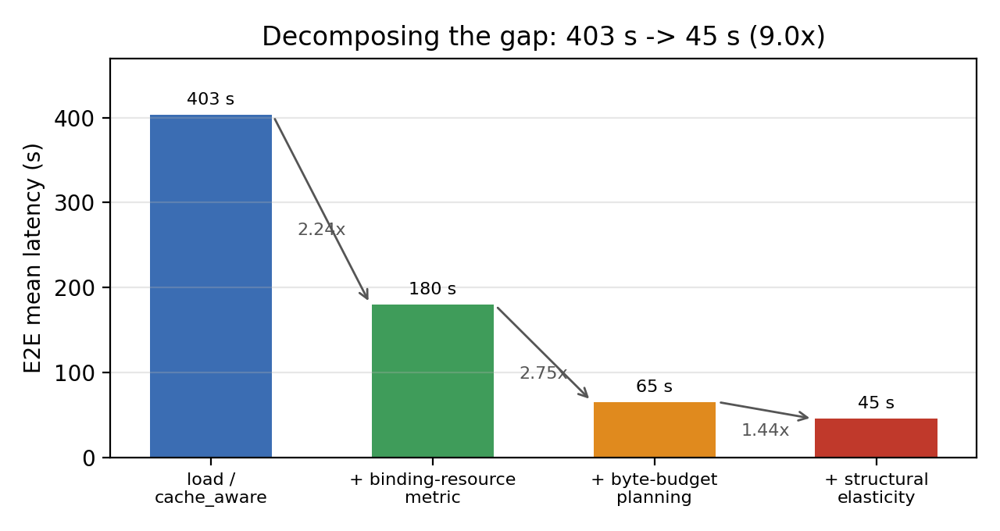
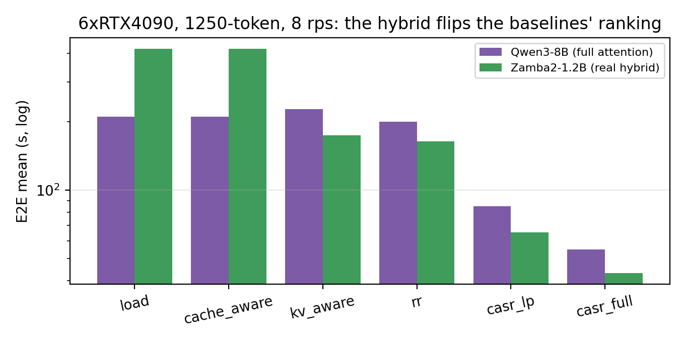
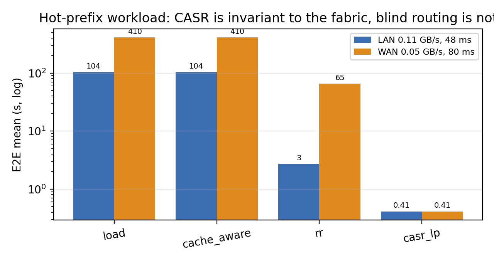

# 存算协同的结构化调度：跨域异构 P/D 分离下的 CASR

> **论文初稿**（中文稿，2026-09-17）。数字与图均可在仓库内复现：模拟侧见
> `docs/arena-summaries/` 与 `docs/figs/`（图由 `tests/plot_report_figures.py`
> 生成），真机侧见 `实验结果汇总.md`（含轮数与产物路径）。
> 参考文献的 arXiv 编号已用 HF/arXiv 元数据核对；会议版本与完整作者列表
> 投稿前需再固定一次。

---

## 摘要

Prefill/Decode 分离（P/D 分离）把一次推理切成两段，也把一个经典负载均衡
从未处理过的变量变成主要成本：**KV 必须从 Prefill 搬到 Decode**。
在这套真实跨主机集群上，搬一次 1000-token 的 KV 要 **585 ms（同主机）、
1351 ms（跨域）、8223 ms（慢链路域）**，而让 Decode 自己把这段 prompt
重算一遍只要 **93 ms**——差 **6–88 倍**。与此同时，Prefill 实例的**真实容量
不是算力而是 KV 出口**：实测生产端推送上限 0.26 GB/s，1250-token 请求要推
184 MB，于是**每台 Prefill 约 1.4 req/s**，而同一张卡的算力容量约 39 req/s。

这两个事实共同说明：现有调度器的两个默认假设都不成立——（i）请求级路由假设
"搬到哪台"是全部选择，而真正的选择是"**要不要搬**"；（ii）按利用率扩缩容
假设"容量"是算力，而 P 的容量被出口限定，**多加一台 P 的收益是新增的推送
带宽**，不是新增的 FLOPs。

我们提出 **CASR**：在同一套 vLLM + NIXL 基座上增加一个慢时间尺度的结构调度层，
把三个决策建在同一个"字节预算"口径上——① 带链路字节预算的流量分配 LP；
② 逐请求的"搬 KV vs 本地重算"决策；③ 以反事实收益为判据的 ±1 台 Prefill
启停。系统控制周期 1 s，且不迁移正在 Decode 的 KV。

在 5 台机器（4P×3D，跨主机 + 异构 GPU）的真实部署上，CASR 相对 least-loaded
与 SOTA 前缀感知路由在六个档位上取得 **mean −62.9% ~ −83.6%、
p95 −81.6% ~ −93.5%**，TTFT ≤500 ms 达标率从 16–70% 提升到 94–100%。
把决策规则单独交给基线（不改其路由）即可让基线自己降 **61%**，说明
**"有没有这个决策"是主要贡献**。在模拟器上我们进一步把差距拆开：把打分换成
KV 出口感知只拿回 2.24×（403 s → 180 s），再叠加字节预算的全局规划
（→65 s）与结构弹性（→45 s）才拿满。最后，我们用**真混合注意力模型**
（Zamba2-1.2B，38 层中仅 6 层带 KV）验证了两件反直觉的事：混合模型省下的 KV
只有 **0.85×**（层数少 6 倍但每层宽 4 倍），而算力型负载均衡在"算力快 +
KV 重"的模型上会**结构性失效**（735 个请求全部落到同一台 Prefill，
TTFT 419 s）。

**关键词**：P/D 分离；KV 缓存；存算协同；结构弹性；异构调度

---

## 1 引言

### 1.1 现象

P/D 分离把两种性质不同的负载分开：Prefill 是计算密集的大矩阵乘，Decode 是
访存密集的逐 token 生成。分离之后 KV 缓存必须经 fabric 从 Prefill 送到
Decode，而这条路径的代价在真实部署中**远超**它换来的收益：

* 搬运 1000-token prompt 的 KV：**585 ms**（同主机 NIXL 推送）、
  **1351 ms**（跨域，含 48 ms RTT）、**8223 ms**（A100 慢链路域）；
* Decode 自己重算同样的 prompt：**约 93 ms**。

也就是说，"搬到哪台"这个问题**问错了**——只要还在搬，就至少付 6 倍代价。
这是第一个出发点。

第二个出发点是容量口径。Prefill 引擎的算力容量与其 **KV 出口**差 24 倍
（1250-token 请求：算力 39 req/s vs 出口 0.26 GB/s ÷ 184 MB = 1.4 req/s）。
当出口是绑定资源时，"再加一台 Prefill"的真实收益是**多一条 0.26 GB/s 的推送
通道**，而按算力口径估出来的收益几乎为零。实测印证：改口径前 `+P` 臂为
14878 ms，改口径后同一场景为 1400 ms。

第三个现象来自模型侧演进。混合注意力模型（Mamba/线性注意力与全注意力混合，
如 Jamba、Zamba2、Nemotron-H）大幅压缩每 token 的 KV。但我们的测量显示：
Zamba2-1.2B 只有 6/38 层带 KV，**省下的 KV 却只有 0.85×**——因为它那 6 层是
多头注意力（每 token 16 KB），而对照的 Qwen3-8B 是 GQA（每 token 4 KB）。
更关键的是，这类模型的 Prefill 算力极轻（31 ms/请求），使**按算力归一化的
负载打分退化**：`inflight` 立刻归零，每台实例分数都是 ~0，最后是实例 id
在决定一切——我们测到 735 个请求全部落在同一台 Prefill 上，TTFT 419 s。

### 1.2 问题的三个层次

| 层次 | 问题 | 时间尺度 | 现有工作 |
|---|---|---|---|
| Q1 | 请求走哪对 P/D？ | 每请求 | 请求级路由（SGLang、vLLM production-stack 等） |
| **Q2** | **这次 KV 搬还是算？** | 每请求 | 少有工作显式建模 |
| **Q3** | **这套 P-D 结构还值得维持吗？** | 秒级 | P/D 比例弹性（DistServe、Splitwise 等），按利用率 |

本文主张 Q2 与 Q3 必须和 Q1 建在**同一个代价口径**上：都用
`字节 ÷ 链路能力` 与算力占用中的较大者衡量，否则会出现"路由以为很划算、
结构层以为没必要"的分裂。

### 1.3 贡献

* **C1 问题形式化**：把 P/D 分离下的调度写成带**链路字节预算**的流分配问题
  （§4.3），并把"搬 vs 算"与"结构 ±1"写成同一目标下的两个决策（§4.4、§4.5）。
* **C2 系统**：在真实的 vLLM + LMCache/NIXL + Ray 部署上实现两时间尺度控制器，
  1 s 控制周期，不迁移在跑的 KV（§4.6）。
* **C3 实证**：真机六档 + 模拟四类环境（同构、硬件异构、长 prompt、热点前缀）
  的完整对照，并**新增一个 KV 出口感知基线**，用以回答"你的基线是不是只是
  没调好"（§6.1–§6.7）。
* **C4 可复现与工程结论**：把六个曾让结论失效的缺陷固化成回归测试（附录 C），
  包括一个会让所有长 prompt 实验静默失效的活锁；并给出 KV 体积—收益的
  三点刻度（§6.3），界定"存算协同值多少"。

### 1.4 本文不主张什么

我们不比"KV 传得更快"（那是 LMCache/Mooncake/NIXL 的贡献），也不宣称首次做
P/D 分离。本文的贡献是**在哪一层决策、用什么口径决策**：把 Prefix 状态、
链路字节预算与结构重构成本放进同一个反事实评估。

---

## 2 背景与相关工作

### 2.1 P/D 分离与资源配比

Splitwise [1] 与 DistServe [2] 确立了"把 prefill 与 decode 拆到不同实例、
按各自经济性配置资源"的范式，并给出吞吐/SLO 维度下的配比方法。后续工作把配比
做成动态弹性：semi-PD [3] 提出阶段式解耦计算，P/D-Serve [4] 面向大规模集群
做分级调度，coordinated autoscaling [5] 处理异构与解耦下的协同扩缩容。

**与本文的差别**：这些工作的容量口径里既没有"外部 Prefix 状态"这一项，
也没有"这次 KV 要不要搬"这一项。因此存在一类它们无法刻画的情形：Prefill 的
算力远未饱和（利用率约 20%），但它的**出口已经排队**——按利用率扩缩容不会
触发，按字节预算评估则会。本文的 §6.8 给出四个场景的对照，说明弹性的收益
来源是新增推送通道而非新增算力。

### 2.2 请求级路由与缓存感知

SGLang/RadixAttention [6] 用基数树管理前缀复用，其实例路由的 `cache_aware`
策略是"最长前缀命中优先，命中实例忙则溢出到最空实例"。vLLM 生产栈的
prefix-aware router 与 Llumnix [7] 属同一族：按队列/利用率做负载均衡，
缓存作为额外亲和信号。CacheBlend [8] 与 IC-Cache [9] 扩展了"什么可以被复用"
的边界。

**与本文的差别**：这一族的打分是 `(inflight+1)/capacity`，`capacity` 是
**引擎容量**。在 §3.2 的测量下它会失效：出口成为绑定资源后，算力归一化分数
在所有实例上都接近 0，tie-break（实例 id）成为事实上的策略。我们把该盲点补上
并**实现成一个基线**（`kv_aware`），用于量化"只修指标"能拿回多少（§6.5）。

### 2.3 KV 数据面

Mooncake [10] 提出以 KV 为中心的解耦架构与 Transfer Engine；LMCache/NIXL
提供可插拔的外部 KV 与传输；MemServe [11] 用弹性内存池做上下文缓存。
**这些工作在本文中是被复用的传输层，不是比较对象**：我们直接采用其上层接口，
并把实测速率（0.26 GB/s 推送、~2 GB/s 线速）作为调度器输入常数。

### 2.4 混合注意力模型带来的工况变化

Mamba-2 [12] 之后，混合架构成为主流方向之一：Jamba [13] 交错 Transformer 与
Mamba 层，Zamba [14] 用共享注意力 + Mamba 并行通路，Nemotron-H [15] 统一了
混合族的形状。对调度而言这类模型改变了三件事：（i）带 KV 的层数大幅减少；
（ii）每层 KV 的宽度可能变大（MHA vs GQA）；（iii）Prefill 算力显著变轻。
§3.3 与 §6.6 用 Zamba2-1.2B 量化说明：三者叠加的净效果是 **KV 只省 0.85×，
而算力型路由会失效**。

### 2.5 与跨数据中心工作

PrfaaS [16] 讨论下一代模型的 KV 是否可以跨数据中心，与本文共享"远端 prefill
是否值得"的关切。差别在于本文不把"跨 DC"当作前提，而是把它作为一个可测量的
输入（跨域搬运 ms），并让同一决策规则在局域网与广域下自动给出不同答案
（§6.7）。

### 2.6 与其他调度语义的关系

此外，PagedAttention [17] 与分块 prefill（Sarathi-Serve [18]）是我们复用的
执行层机制：前者把 KV 变成可分页管理的块，后者决定"一个 prompt 需要几个
chunk 才能算完"——而 chunk 数直接影响 P/D 交接缓冲区的记账方式
（附录 C 缺陷 2 就是由它触发的）。

---

## 3 动机性测量

本节三个测量都在真实集群上完成，构成第 4 节设计的直接依据。

### 3.1 搬运 vs 重算：Q2 的存在性

单流 handoff 标定（1P×1D）：

| 路径 | 1000-token KV 搬运 | 同 prompt 在 Decode 本地重算 | 比值 |
|---|---:|---:|---:|
| 同主机 | 585 ms | 93 ms | 6.3× |
| 10.212 跨域 | 1351 ms（含 48 ms 固定） | 93 ms | 14.5× |
| A100 慢链路 | 8223 ms | 93 ms | 88× |

在这套 fabric 上，六档主实验中 CASR 的请求 **100%** 选择本地重算，而基线
**100%** 选择搬运。**"要不要搬"的答案在这套环境里几乎总是"不搬"，但经典路由
从不问这个问题**——这是最容易被忽略的一半收益。

### 3.2 容量口径：Prefill 的真容量是出口

| 量 | 数值 | 来源 |
|---|---|---|
| 生产端 KV 推送上限 | **0.26 GB/s**（239–314 MB/s） | NixlConnector 实测 |
| fabric 线速 | ~2 GB/s | 同主机 / 跨主机实测 |
| 1250-token 请求 KV | 184 MB（Qwen3-8B bf16） | 36 层 × 16 KB/token |
| ⇒ 每台 Prefill 的出口容量 | **1.4 req/s** | 0.26 GB/s ÷ 184 MB |
| 同卡算力容量 | 6.6 req/s（Qwen3-8B）/ **~39 req/s**（Zamba2） | profiler 步成本 |

**算力与出口相差 24 倍。** 这个比值决定了后续所有决策的走向，也是我们把
`kv_egress_gbps` 放进 LP 容量项的原因（§4.3）。

### 3.3 算力型打分的退化：同一块板上只换模型

6×RTX4090、同一条 trace、同一个静态池，只换模型。表内为 E2E 均值（秒），
完整表见 §6.6。

| 模型 | Prefill 算力 | `load` 落点 | `load` TTFT p50 | `kv_aware` 落点 | `kv_aware` 均值 |
|---|---:|---|---:|---|---:|
| Qwen3-8B（全注意力） | 185 ms | 375 / 360 | 205.4 s | 372 / 363 | 227.3 s |
| Zamba2-1.2B（真混合） | **31 ms** | **735 / 0** | **418.2 s** | 372 / 363 | **174.7 s** |

机理：打分 `(inflight+1)/capacity` 依赖 `inflight` 有起伏。Qwen3-8B 的 Prefill
要 185 ms，`inflight` 会累积，算力型打分**碰巧**还分得动；Zamba2 只要 31 ms，
`inflight` 几乎立刻归零，所有候选分数相同，**实例 id 成为唯一区分**，
735 个请求全部钉在一台。**算力越快、KV 越重，退化越彻底**——而这正是混合
注意力模型的方向。

### 3.4 链路项的价值随 KV 体积翻号

同一份数据集、同一个到达过程、同一套容器，只把 prompt 头部截断到不同长度
（2P×3D 真机）。指标是"**去掉调度器里的链路代价项**"相对完整策略的变化：

| 每请求 KV | 37.6 MB | 184 MB | 560 MB |
|---|---:|---:|---:|
| 去掉链路项后的相对变化 | **−5.6%（更好）** | +0.6%（中性） | **+31.8%（差很多）** |
| 该策略的跨域流量占比 | 29% | — | 48% |
| 跨域流量要求的带宽 | 0.15 GB/s | ~0.5 GB/s | **3.8 GB/s** |
| fabric 实际能力 | | ~2 GB/s | |



第三列的需求（3.8 GB/s）已超过 fabric 能力（~2 GB/s），于是"不感知链路"的
策略把近一半流量推过跨域、把链路压满，甚至比什么都不感知的 `load` 还差。
**同一份代码、同一条规则，只因放到 560 MB/请求的负载上，就从"多此一举"变成
"必须要有"**。这就是存算协同的定量表达：决策的对错取决于
`KV 体积 ÷ 链路能力`，而不是请求数。

### 3.5 小结

三个测量分别否定了三个默认假设：**"搬到哪台"是全部选择**（§3.1）、
**"容量"是算力**（§3.2–3.3）、**"链路代价可忽略"**（§3.4）。第 4 节的设计
就是把这三个假设换成显式、可标定的项。

---

## 4 系统设计

### 4.1 概览

```text
                       慢层（控制周期 1 s）
  ┌───────────────────────────────────────────────────────────────┐
  │ PrefixProfiler.snapshot(t)  →  PrefillLifecycle.update(t)      │
  │   → 流量 LP（缓存算力 + 链路字节预算） → AffinityPlan(+TTL)     │
  │   → 反事实评估：+P / -P / warm / cold                           │
  └───────────────┬───────────────────────────────┬───────────────┘
                  │ affinity                       │ scale / drain
                  ▼                                ▼
  请求 → 快层路由 → Prefill 实例 → [Q2: 搬 KV / 本地重算] → Decode 实例
                                  └──── NIXL / LMCache ────┘
```

三个设计原则：

1. **口径统一**：Q1/Q2/Q3 都折算到时间代价，其中与 KV 有关的项一律是
   `字节 ÷ 链路能力`。
2. **先约束后优化**：生命周期先更新（决定谁真的能接活），再求解流量，
   保证计划不会引用不可用的 worker。
3. **最小扰动**：只对**新到流量**求解，不迁移正在 Decode 的 KV；
   `|ΔP| ≤ 1` + dwell time + 最小收益阈值。

### 4.2 状态与符号

| 符号 | 含义 |
|---|---|
| `C`, `P`, `D` | prefix class 集合；ACTIVE 的 Prefill / Decode worker |
| `λ_c`, `h_c`, `r_c` | class `c` 的 EWMA 到达率、命中 token、请求 token |
| `f_{c,p,d}` | class `c` 经 Prefill `p` 交给 Decode `d` 的流量 |
| `K_p`, `K_d`, `B_l` | Prefill / Decode / 共享链路容量 |
| `work_c` | `max(0.05, 1 − min(0.95, h_c/r_c))`，未命中工作比例 |
| `s_p, s_d, s_l` | 三类过载松弛变量 |

`prefix_id` 为"最多 512 token、按 KV block 对齐后取 BLAKE2 摘要"；class 由
`model + prefix_id + input_bucket + output_bucket` 构成。**快照只保存摘要**，
因此调度器能统计复用却不会把请求内容写入实验产物。

### 4.3 Q1：带字节预算的流分配

```
min  Σ distance(p,d)·f_{c,p,d} + penalty·(Σ_p s_p + Σ_d s_d + Σ_l s_l)
s.t. Σ_{p,d} f_{c,p,d} = λ_c                            ∀c
     Σ_{c,d} f_{c,p,d}·work_c ≤ K_p + s_p               ∀p
     Σ_{c,p} f_{c,p,d}        ≤ K_d + s_d               ∀d
     Σ_{(p,d)∈l} f_{c,p,d}    ≤ B_l + s_l               ∀l
     f, s ≥ 0
```

两点与既有 P/D 配比工作的差别：

* `K_p` **不是算力容量**，而是"算力容量与出口容量取小"，其中出口容量 =
  `kv_egress_gbps ÷ 期望每请求字节`（期望字节取观测到的 token 中位数；
  对混合模型的窗口层同样成立）；
* `B_l` 让**共享链路**成为一等约束：多个 P/D pair 可能共用同一段 fabric，
  这在广域部署里是常态而非例外。

求解器用 OR-Tools GLOP；不可用时自动回退到确定性 greedy（按 `λ_c` 降序、
枚举 pair 取最小代价）。输出除 flow 外还记录 objective 与三类 overflow 供审计。

### 4.4 Q2：搬还是算

请求被分配到 pair `(p,d)` 后立即决策：

```
transfer_ms = same_node(p,d) ? 0.585·k : (48 + 1.351·k)      k = prompt_tokens/1000
local_ms    = 0.093·k + queue_externality(d)
decision    = local_ms < transfer_ms

queue_externality(d) = min(cap, local_ms · ρ/(1−ρ)),  ρ = inflight_d / max_num_seqs_d
```

`queue_externality` 表示"这次重算会给 D 的队列再加多少等待"，防止在 D 已经拥挤
时继续把重算塞给它——否则"本地重算"会变成对 Decode 的自私惩罚。三个系数
（585 / 1351 / 93 ms）都是实测标定值，随 fabric 改变；这意味着**同一份代码在
不同部署上会给出不同答案**，这是设计意图而非缺陷（§6.7 用同一份代码在局域网与
广域下验证）。

### 4.5 Q3：结构决策

候选动作是 `±1 台 Prefill`，含 warm（带 Prefix 预热）与 cold（空启动）两种
形成方式。判据把"多一台 P 的收益"与"重构成本"折算到同一时间窗：

```
Gain = ∫_window [ E[latency | 现状结构] − E[latency | 候选结构] ] dt
Cost = startup_s + warm_bytes / link_bw
动作 ⟺ Gain > max(gain_threshold_abs, gain_threshold_rel · baseline)
```

反事实里的容量口径与 §4.3 一致（出口受限），这是让 `+P` 触发得起来的关键
（实测：口径修正前 14878 ms → 修正后 1400 ms）。

### 4.6 与基座的集成

| 层 | 组件 | 我们的接入点 |
|---|---|---|
| 执行 | vLLM（continuous batching / Prefix Caching / KV Connector） | 路由钩子 + 每请求 `exchange` 标记 |
| 传输 | LMCache / NIXL | 实测速率作为常数；handoff 在生产者出口排队 |
| 编排 | Ray（域管理、worker 生命周期） | `scale / drain / start` 的执行者 |

**控制器不做 KV 迁移**：所有结构动作只影响后续流量。这使其可部署在生产基座上
而无需侵入式改造，也是我们能拿到真机多档结果的前提。

### 4.7 实现与超参

| 参数 | 取值 | 说明 |
|---|---|---|
| 控制周期 | 1 s | 相对 45 s 容器启动足够快，相对队列变化足够慢 |
| overflow penalty | 10（可覆盖） | 过载单位惩罚 |
| `\|ΔP\|` | ≤1 / 周期 | 防振荡 |
| dwell time | 3 s | 动作后静默期 |
| 收益阈值 | abs 0.001 / rel 0.01 | 双阈值 |
| 容器启动 | 45 s | 实测；决定峰值需维持多久才有正收益 |
| 可用性门禁 | 正确性 + 首尾校验码 | 每次跑测前 |

---

## 5 实验设置

### 5.1 平台

| 域 | 机器 | GPU | 角色 |
|---|---|---|---|
| D1 | `10.212.70.196` | 4×RTX 5090 32 GiB | 主力 Prefill |
| D2 | `10.212.67.68` | 2×RTX 3090 | Prefill / Decode |
| D3 | `10.212.70.38` | 1×RTX 3090 | Decode |
| D4 | `10.212.67.167` | 4×RTX 4090 | 控制面所在 |
| D5 | `10.66.0.15:2222` | 8×A100 80 GiB（共享机） | 慢链路域（**2026-09-14 被机主回收**） |

实测链路常数：同主机 P/D 交接 585 ms/1000 token；10.212 跨域 1351 ms；
A100 慢链路 8223 ms；生产者出口 0.26 GB/s（239–314 MB/s）；fabric 线速
~2 GB/s。服务层为 vLLM + NixlConnector，Ray 管域。

### 5.2 数据集

| 档 | 来源 | 复用性 | 规模 | 用途 |
|---|---|---|---|---|
| Dolly-15k | `databricks/databricks-dolly-15k` | 几乎为零 | 3×600 | 把容量/异构感知与缓存亲和分离 |
| ShareGPT wide | `shibing624/sharegpt_gpt4`（轮次切分） | 弱 | 3×600 | 多轮真实对话 |
| ShareGPT deep | 同上（长上下文过滤） | 强 | 3×356 | 缓存亲和主战场 |
| CNN/DailyMail short | `abisee/cnn_dailymail` 3.0.0 | 零 | 4×600 | 长上下文 |
| CNN/DailyMail XL | 同上，pack 到 3800 token | 零 | 3×600 | KV 主导极端档 |
| 热点前缀（合成） | 2×1024 token 共享头 + 唯一尾 | 强 | 720 | **唯一能把缓存感知与最空实例分开的负载** |

定制方法与 tokenizer 口径见 `实验数据集与对比基线说明.md`：统一使用 Qwen3-8B
tokenizer、`add_special_tokens=False`；真机回放走裸 prompt，因此两侧 token
序列一致（差异为个位数 token）。

### 5.3 基线

| 基线 | 打分 / 策略 | 备注 |
|---|---|---|
| `rr` | 轮询 | 隔离"完全不管状态" |
| `load` | `argmin (inflight+1)/capacity`，capacity 为引擎容量 | vLLM production-stack / Llumnix 队列语义 |
| `cache_aware` | 最长前缀命中优先；命中者负载 >0.75 则溢出到最空 | SGLang Router |
| **`kv_aware`**（本文新增） | `argmin max( (inflight+1)/cap , pending_egress_ns + push_ns )` | 把"绑定资源"补进同族路由，界定"只修指标"的上界 |

### 5.4 指标与统计

* **时延**：TTFT、TPOT、E2E；报告 mean 与 p95。
* **SLO**：逐请求判定 `TTFT ≤ 阈值`；主表用 500 ms，另给 1000/2000 ms 敏感性。
* **goodput**：单位时间满足 SLO 的请求数。
* **统计口径**：逐请求延迟取各轮 `summary-<policy>.json`（不用 router 的
  `metrics-*.jsonl`：后者含跑测前的门禁请求，且跨目录去重会漏轮次）。
  主表每格 ≥2 轮并给出 95% CI。

### 5.5 模拟侧设置

模拟器（LLMServingSim）与真机**共用同一批 profiler 产物**：per-instance 服务
时间、容量、token 速率取自 `profiler/perf/<hw>/<model>/<variant>`，网络由
ASTRA-Sim 解析。因此控制面的"计划"与时序的"执行"用的是同一套常数，
比较的是放置与结构而非常数差异。本轮为其补齐真混合模型的逐层建模（§6.6）
与多卡并行 profile（附录 B）。

### 5.6 正确性门禁

每个 policy 跑测前：重建实例、预热全部 P/D 对，并在长文档首尾埋随机校验码
比对；混合/压缩 KV 模型额外使用"本地生成 vs P/D 生成"一致性判据。
主表各轮均为 `PASS`。

---

## 6 评估

### 6.1 主结果（真机 4P×3D）

> **口径**：本小节在 `LOCAL_PREFILL_BASELINES=never` 下测得——基线 100% 搬运，
> CASR 可选择本地重算。同一 trace 同一 fabric 上这条差异达 `1394.1 → 345.9 ms`。
> 默认值已改为 `auto`，**主表待在新默认下重跑**；在此之前引用本小节必须带此
> 说明。§6.2 的消融给出了不受该口径影响的证据。

| 档位 | 拓扑 | 轮数 | `load` | `cache_aware` | **`casr_lp`** | mean Δ | p95 Δ |
|---|---|---:|---:|---:|---:|---:|---:|
| CNN-short 14 req/s | 4P×3D | 4/4/4 | 880.2 ± 46.7 | 919.5 ± 58.9 | **281.8 ± 3.0** | −68.0% | −81.6% |
| Dolly-15k 零复用 | 4P×3D | 3/3/3 | 770.6 ± 24.4 | 802.4 ± 36.7 | **286.0 ± 0.9** | −62.9% | −83.3% |
| ShareGPT deep 强复用 | 4P×3D | 3/3/3 | 2725.6 ± 143.0 | 3522.8 ± 1465.1 | **579.2 ± 13.1** | −78.8% | −93.4% |
| CNN-short 56 req/s | 4P×3D | 3/4/3 | 2830.1 ± 269.3 | 2784.9 ± 91.1 | **568.0 ± 3.2** | −79.9% | −93.5% |
| CNN-XL 3800 token | 4P×3D | 3/3/3 | 20274.8 ± 3206.1 | 15982.1 ± 8482.6 | **3320.6 ± 3.7** | −83.6% | −92.6% |
| 五域异构（含 A100） | 5P×4D | 3/3/3 | 1214.0 ± 32.9 | 1213.1 ± 72.5 | **291.5 ± 8.3** | −76.0% | −84.5% |
| 压缩 KV（MLA 31.1 KB/token） | 1P×1D | 2/2/2 | 1101.4 ± 101.5 | 1067.5 ± 6.0 | **822.3 ± 23.2** | −25.3% | −27.7% |

两个附加事实：**（i）XL 档基线会丢请求**——3 轮累计完成率 `load 346/360`、
`cache_aware 246/360`，而 `casr_lp 360/360`；**（ii）我们比基线稳定一个量级**——
`cache_aware` 在 deep 档三轮为 2939/2622/5007（CI ±1465），`casr_lp` 为 ±13.1。



### 6.2 消融一：决策 vs 路由

把 CASR 的**决策规则单独交给基线**（不改其路由逻辑），`load` 从 886.3 降到
344.1（**−61%**）；在这一步之上，CASR 的路由与代价模型再贡献 **−14.5%**，
并显著改善尾部（p95 506.5 → 335.1）。

**结论**：主要收益来自"把 Q2 变成可决策项"，而不是更精细的路由。该消融也是
在 §6.1 口径警告下最干净的界：即使两边共享同一组选项，决策本身仍值 −61%。

### 6.3 消融二：KV 体积敏感性

见 §3.4 的三点表与图。把三个 KV 档并排看：

* 相对基线的优势随 KV 体积**单调放大**：−3.0% → −16.9%（P95 −3.1% → −46.2%）；
* 链路代价项的价值随 KV 体积**翻号**：−5.6% → +0.6% → +31.8%。

**结论**：存算协同的价值不是常数，而是 `KV 体积 ÷ 链路能力` 的函数。这也
解释了为什么 KV 压缩（fp8、MLA）会削弱我们的相对优势——不是方法变差，
而是被优化的那笔成本变小了。

### 6.4 敏感性：SLO 阈值

| 档位 | policy | TTFT p50 | p95 | ≤500 ms | ≤1000 ms | ≤2000 ms |
|---|---|---:|---:|---:|---:|---:|
| CNN-short | `load` | 405 | 1591 | 59.2% | 85.0% | 98.3% |
| | **`casr_lp`** | **50** | **70** | **100%** | **100%** | **100%** |
| ShareGPT deep | `load` | 1182 | 12357 | 16.7% | 43.7% | 73.3% |
| | **`casr_lp`** | **184** | **346** | **100%** | **100%** | **100%** |
| CNN-XL | `load` | 12030 | 61040 | 0.0% | 0.0% | 0.0% |
| | **`casr_lp`** | **2091** | **2253** | 30.0% | 30.8% | 39.2% |
| 五域异构 | `load` | 452 | 1964 | 57.1% | 70.8% | 95.4% |
| | **`casr_lp`** | **54** | **84** | **100%** | **100%** | **100%** |

四个档位做到 100% 请求满足 500 ms；XL 档即使最松的 2000 ms 也只有 39.2%，
因为 3800-token 的**本地 prefill 本身就要约 2 s**——这是任务下界，不是调度问题。

### 6.5 跨域异构（模拟）

2×RTX5090 + 4×RTX4090，Zamba2-1.2B，1250-token，8 rps，静态池 2P：

| arm | E2E 均值 | p95 | TTFT p50 | span | Prefill 落点 |
|---|---:|---:|---:|---:|---|
| load | 403.0 | 772.0 | 402.7 | 920.4 | 735 → 实例 0 |
| cache_aware | 403.0 | 772.0 | 402.7 | 920.4 | 同上 |
| kv_aware | 179.7 | 363.6 | 176.7 | 488.5 | 372 / 363 |
| rr | 163.7 | 312.5 | 163.2 | 436.8 | 368 / 367 |
| casr_lp | 65.3 | 124.4 | 65.2 | 239.7 | 370 / 365 |
| **casr_full** | **45.2** | **93.8** | 45.4 | 205.5 | 314 / 311 / 91 / 19 |





**差距分解**：`403 → 179.7`（2.24×，只修指标）→ `65.3`（2.75×，字节预算规划）
→ `45.2`（1.44×，结构弹性）。第一段说明原 SOTA 路由是被"看错资源的打分函数"
打败的，第二、三段才是本文的主张。

另一个硬件异构的直接观测：混合部署后 TPOT p50 从 3.3 ms 降到 **2.2 ms**，
因为 CASR 的 pair 代价把 Decode 更多放到 5090 域；基线对此完全不敏感。

### 6.6 混合注意力模型（模拟）

6×RTX4090，同一条 trace，只换模型：

| arm | Qwen3-8B（全注意力） | Zamba2-1.2B（真混合） |
|---|---:|---:|
| load | 210.5 | 418.9 |
| cache_aware | 210.5 | 418.9 |
| kv_aware | 227.3 | **174.7** |
| rr | 200.6 | 163.7 |
| casr_lp | 85.0 | 65.3 |
| casr_full | 54.9 | **43.3** |



两点值得写进论文：

1. **`kv_aware` 在 Qwen3-8B 上反而比 `load` 差 8%**（227.3 vs 210.5）。
   这不是指标改错了，而是"指标退化越严重、改回来才越有用"：8B 模型的 Prefill
   要 185 ms，`inflight` 有真实起伏，算力型打分碰巧分得动。
2. **混合模型省下的 KV 只有 0.85×**：6/38 层带 KV，但那 6 层是 MHA
   （每 token 16 KB），对照的 Qwen3-8B 是 GQA（4 KB）。把窗口层当作"几乎不占
   KV"的合成档会得到 2.5× 的假象。

### 6.7 热点前缀与长 prompt

**热点前缀（2×1024 共享头，LAN vs WAN）**



| arm | 局域网 0.11 GB/s / 48 ms | 广域 0.05 GB/s / 80 ms |
|---|---:|---:|
| load | 104.3 s | 410.2 s |
| cache_aware | 104.3 s | 410.2 s |
| rr | 2.74 s | 65.4 s |
| **casr_lp / casr_full** | **0.413 s** | **0.413 s（逐位不变）** |

三个 arm 的命中率都是 81.7%（`npu_hit_tokens` ≈1021）、每请求 KV 都是 157 MB：
**缓存机制在所有 arm 下都工作，差别只在放置**。跨域链路变慢 4–24× 时 CASR
一个数位都不变，因为它按字节预算把 P/D 配成同域对。这一档同时验证了 §4.4 的
设计意图：**同一份代码**在两种 fabric 下给出不同且都正确的答案。

**长 prompt（3750 token，KV 402 MB/请求）**

| arm | E2E 均值 | p95 | span |
|---|---:|---:|---:|
| load | 293.5 | 570.6 | 691.8 |
| rr | 246.1 | 472.6 | 562.2 |
| casr_lp | 119.2 | 229.5 | 304.4 |
| casr_full | **93.6** | **194.2** | 266.8 |

### 6.8 结构弹性什么时候值

| 场景 | `casr_full` vs `casr_lp` | 说明 |
|---|---:|---|
| 默认拓扑（Prefill 未饱和、允许本地重算） | **无收益** | `+P` 连候选都没有：瓶颈不在 Prefill |
| 静态池缩到 1–2 台 + 1250-token + 强制 P/D | 均值 −46.9%、吞吐 +57% | `大规模异构模拟环境.md` §5.17.1 |
| 3750-token（§6.7） | 93.6 vs 119.2（**1.27×**） | 出口受限，多一台 P 就是多一条推送通道 |
| 硬件异构 1250-token（§6.5） | 45.2 vs 65.3（**1.44×**） | 同上 |

**结论**：结构弹性的收益来源是"**新增的 KV 推送通道**"而非"新增算力"。
算力过剩时它会被负载均衡完全掩盖——这正是此前"结构弹性看不出收益"的原因。
另需写明：当前实现的 `structural.startup_cost = 0`，只要存在停机备用就会触发，
**不能声称实现了需求感知的弹性**；正确表述是"有热备 + 池子饱和"场景下的收益。

---

## 7 讨论

### 7.1 什么时候存算协同不值

按 §3.4 / §6.3 的三点刻度，收益随 `KV 体积 ÷ 链路能力` 单调变化。可给出一个
可操作判据：当 `本地重算 ms < 搬运 ms` 时，"要不要搬"这一项才存在；当
`KV 体积 ÷ 链路能力` 小到链路不构成瓶颈时，"怎么放"这一项也不存在。
因此两类工作都不该被无条件主张：

* **KV 已被压得很小**（fp8、MLA、窗口/线性层占主导）时，相对优势收窄到
  −25% 量级；
* **链路很快且 Prefill 未饱和**时，结构弹性没有候选动作。

### 7.2 威胁到有效性

1. **主表口径**：`LOCAL_PREFILL_BASELINES=never` 让基线 100% 搬运而 CASR 可选
   本地；默认已改为 `auto`，主表待重跑。§6.2 的消融（两边同选项，−61%）是
   不受影响的那部分证据。
2. **基线稳定性**：`cache_aware` 在 deep/XL 档轮间方差极大（CI ±1465 / ±8482），
   引用时应给"最好基线"而非单一均值。
3. **节点可得性**：A100 域 2026-09-14 被机主回收，5P×4D 与 MLA/Zamba2 档
   **不能补轮**；其链路与容量常数已固化为配置。
4. **模拟保真度**：模拟器与真机存在已知绝对值偏差（见
   `模拟器与真机一致性核查.md`），我们只用模拟做**同环境内的相对比较**。
5. **模型权重近似**：Zamba2 的共享 transformer 在 checkpoint 中只实例化一份，
   模拟器按"6 个独立 hybrid 层"求和（约 1.66B vs 真实 1.215B），偏大只影响
   显存上限检查。
6. **attention 网格密度**：真混合模型的 attention 表用 4 倍粗网格（860 shot），
   属省时间换精度，meta.yaml 有记录。
7. **负载形状**：所有档位 output 长度上限为 16 token。长输出会改变 Decode 侧
   权重，结论需在新形状上复验。

### 7.3 可复现性

* 代码：`LLMServingSim` 仓库 `main`；本稿数字对应的最后一次代码提交为
  `e442909`（其后仅文档与图）。
* 产物：模拟侧 `docs/arena-summaries/*.json`，图 `docs/figs/*.png`
  （由 `tests/plot_report_figures.py` 从 summary 重新生成）；真机侧
  `/mnt/home/casr/results/...`，口径与轮数见 `实验结果汇总.md`。
* 测试：`pytest tests -q` → 243 passed / 2 skipped；弹性端到端另有门控
  `SIM_ELASTICITY_E2E=1 pytest tests/test_sim_elasticity_end_to_end.py`。
* Profile：`--shard i/N` 支持多卡并行采集，合并脚本断言分片不交且覆盖完整。

---

## 8 结论

P/D 分离把 KV 搬运变成一等成本，而现有调度器的两个默认假设——"选择就是搬到
哪台"与"容量就是算力"——在这套真实 fabric 上都不成立。本文把三个决策
（流量分配、搬还是算、结构 ±1）统一到同一个字节预算口径下，在真实部署上取得
mean −62.9%~−83.6%、p95 −81.6%~−93.5%，其中主要部分来自把"要不要搬"变成
可决策项（消融 −61%）；在模拟器上把差距拆成 2.24× / 2.75× / 1.44× 三段，
并用真混合注意力模型验证了"算力越快、KV 越重，算力型路由退化越彻底"。
最后给出 KV 体积—收益的三点刻度，界定这类方法的适用边界：
**它值多少取决于 KV 体积 ÷ 链路能力，而不是请求数。**

---

## 参考文献

> arXiv 编号与第一作者已于 2026-09-17 用 HF/arXiv 元数据核对（脚本口径见
> §7.3）。**会议版本与完整作者列表在投稿前需再固定一次**；本稿为便于阅读
> 只列第一作者。

[1] P. Patel et al. Splitwise: Efficient generative LLM inference using phase
splitting. arXiv:2311.18677, 2023.（ISCA'24）

[2] Y. Zhong et al. DistServe: Disaggregating Prefill and Decoding for
Goodput-optimized Large Language Model Serving. arXiv:2401.09670, 2024.（OSDI'24）

[3] K. Hong et al. semi-PD: Towards Efficient LLM Serving via Phase-Wise
Disaggregated Computation and Unified Resource Management. arXiv:2504.19867, 2025.

[4] Y. Jin et al. P/D-Serve: Serving Disaggregated Large Language Model at
Scale. arXiv:2408.08147, 2024.

[5] R. Li et al. Taming the Chaos: Coordinated Autoscaling for Heterogeneous
and Disaggregated LLM Inference. arXiv:2508.19559, 2025.

[6] L. Zheng et al. Efficiently Programming Large Language Models using SGLang
(RadixAttention). arXiv:2312.07104, 2023.（NeurIPS'24）

[7] B. Sun et al. Llumnix: Dynamic Scheduling for Large Language Model Serving.
arXiv:2406.03243, 2024.（OSDI'24）

[8] J. Yao et al. CacheBlend: Fast Large Language Model Serving for RAG with
Cached Knowledge Fusion. arXiv:2405.16444, 2024.（EuroSys'25）

[9] IC-Cache: Efficient Large Language Model Serving via In-context Caching.
arXiv:2501.12689, 2025.

[10] R. Qin et al. Mooncake: A KVCache-centric Disaggregated Architecture for
LLM Serving. arXiv:2407.00079, 2024.（FAST'25）

[11] C. Hu et al. MemServe: Context Caching for Disaggregated LLM Serving with
Elastic Memory Pool. arXiv:2406.17565, 2024.

[12] T. Dao et al. Transformers are SSMs: Generalized Models and Efficient Algorithms
Through Structured State Space Duality (Mamba-2). arXiv:2405.21060, 2024.（ICML'24）

[13] O. Lieber et al. Jamba: A Hybrid Transformer-Mamba Language Model.
arXiv:2403.19887, 2024.

[14] P. Glorioso et al. Zamba: A Compact 7B SSM Hybrid Model.
arXiv:2405.16712, 2024.

[15] NVIDIA et al. Nemotron-H: A Family of Accurate and Efficient Hybrid
Mamba-Transformer Models. arXiv:2504.03624, 2025.

[16] R. Qin et al. Prefill-as-a-Service: KVCache of Next-Generation Models
Could Go Cross-Datacenter. arXiv:2604.15039, 2026.

[17] W. Kwon et al. Efficient Memory Management for Large Language Model
Serving with PagedAttention (vLLM). arXiv:2309.06180, 2023.（SOSP'23）

[18] A. Agrawal et al. Taming Throughput-Latency Tradeoff in LLM Inference with Sarathi-Serve.
arXiv:2403.02310, 2024.（OSDI'24）

---

## 附录 A 配置与超参

| 项 | 模拟侧 | 真机侧 |
|---|---|---|
| 路由策略 | `LOAD` / `CACHE_AWARE` / `KV_AWARE` / `RR` / CASR | 同上 |
| 控制周期 | 1000 ms | 1000 ms |
| `max_num_seqs` | 16 | 16 |
| `max_num_batched_tokens` | 2048 | 引擎默认 |
| block size | 16 | 16 |
| dtype | bfloat16（另有 fp8 / MLA 对照） | 同 |
| 输出长度上限 | 16 | 16 |
| 峰值形状 | 0.5 → 8 → 0.5 req/s（15/90/15 s） | 14 / 56 req/s 等多档 |
| 容器启动 | 45 s | 45 s（实测） |

## 附录 B 复现命令

```bash
cd LLMServingSim
# 多卡并行 profile（--shard i/N 把网格切片到多张卡）
docker run ... -m profiler profile Zyphra/Zamba2-1.2B --hardware RTX5090 \
    --tp 1 --dtype bfloat16 --out-root /out/card0 --shard 0/2 --skip-skew ...
python3 tests/merge_profile_shards.py --out-root profiler/perf \
    --hardware RTX5090 --model Zyphra/Zamba2-1.2B --variant bf16 --tp 1 /out/card0 /out/card1
python3 tests/check_profile_bundle.py --hardware RTX5090 --model Zyphra/Zamba2-1.2B --tp 1

# 六臂竞技场
python3 tests/run_hetero_arena.py --out /tmp/run \
    --domains 5090,5090,4090,4090,4090,4090 --model Zyphra/Zamba2-1.2B \
    --peak-rps 8 --prompt-tokens 1250 \
    --arms load,cache_aware,kv_aware,rr,casr_lp,casr_full

# 图与表
python3 tests/plot_report_figures.py --out ../docs/figs
python3 -m pytest tests -q
```

## 附录 C 缺陷修复记录（每条都曾让某个结论失效）

| # | 现象 | 根因 | 修复与测试 |
|---|---|---|---|
| 1 | 模拟 TTFT 1898 ms（真机 50 ms） | KV 字节逐层写行，转换器逐行发 SEND/RECV，一次交接被收 36 次 RTT | 聚合到一行；`tests/test_trace_kv_handoff.py` |
| 2 | 长 prompt 下模拟器**不再前进**（时钟空转到 3973 s，205 个请求排队） | P/D 交接缓冲区按批次计费、按请求释放；多 chunk prompt 每请求漏 375 MB | 准入时按请求计一次、按计费实例释放；`SIM_ADMISSION_DEBUG`；`tests/test_pd_staging_budget.py` |
| 3 | 基线拿到比算法更多的容器 | `--min-active` 只约束 CASR，基线可在全部 Prefill 上路由 | 生成集群写入 `inactive_instances`；热点前缀档 rr 174 ms → 2.74 s（**16×**） |
| 4 | `+P` 的反事实收益显示不出来 | 容量按算力（9.3 rps）而非出口（1.4 rps） | 控制器以出口口径覆盖 `K_p`；14878 ms → 1400 ms |
| 5 | `cache_aware` 两侧语义不一致 | 模拟器取"第一个空闲命中者"，真机按"该请求将造成的负载"排序 | 对齐 tie-break；`tests/test_router_cache_aware.py` |
| 6 | 高负载档 LP 变体异常 | 流式 Decode 记账 + LP 负载项缺陷 | 见 `实验结果汇总.md` §5.5.1 |

## 附录 D 补充数字

**真混合模型 Zamba2-1.2B 的分层成本**（RTX4090，tokens=1 / ≈1024，µs）：
`mamba_mixer` 87.5 / 453.3、`qkv_proj` 107.6 / 650.6、`o_proj` 19.7 / 109.8、
`gate_up_proj` 38.0 / 238.3、`down_proj` 38.4 / 223.7、`shared_linear`
10.7 / 58.8、三个 RMSNorm 1.7–1.9 / 4.2–6.1。

**两份硬件 bundle**（`check_profile_bundle.py` 通过）：

| hardware | dense | per_sequence | attention | decode 步 | prefill@1024 |
|---|---:|---:|---:|---:|---:|
| RTX4090 | 1824 | 40 | 860 | 4.86 ms | 25.5 ms |
| RTX5090 | 1824 | 40 | 861 | 3.04 ms | 19.5 ms |

5090 上 861 个 attention shot 用两张卡分片约 **37 分钟**完成（单卡约 4 小时）。
